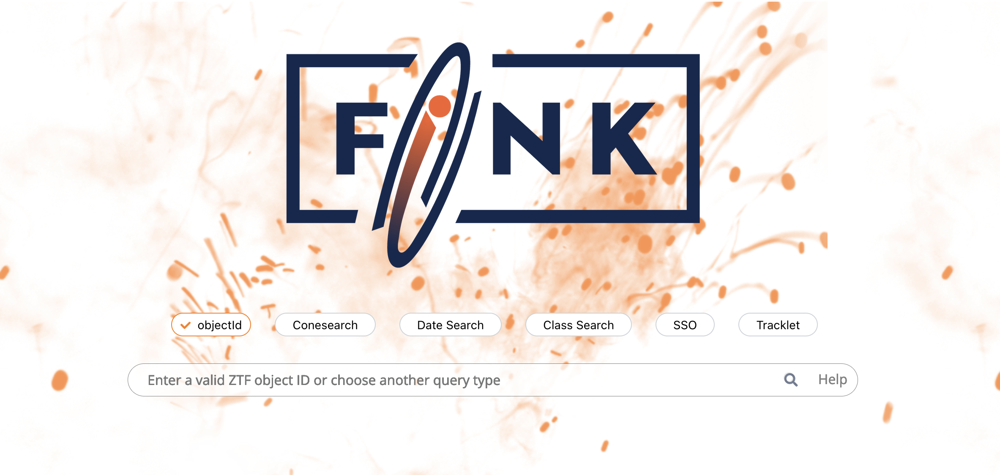

# Fink Science Portal

[](https://github.com/astrolabsoftware/fink-science-portal/actions?query=workflow%3ASentinel)



The Fink Science Portal allows users to browse and display alert data collected and processed by Fink from a web browser: [https://fink-portal.org](https://fink-portal.org).

The backend is using [Apache HBase](https://hbase.apache.org/), a distributed non-relational database. The frontend is based on [Dash](https://plotly.com/dash/), a Python web framework built on top of Flask, Plotly and React. The frontend has also integrated components to perform fit on the data, such as [gatspy](https://www.astroml.org/gatspy/) for variable stars, [pyLIMA](https://github.com/ebachelet/pyLIMA) for microlensing, or the [imcce](https://ssp.imcce.fr/webservices/miriade/) tools for Solar System objects.

## Backend structure

After each observation night, the data is aggregated and pushed into Apache HBase tables. The main table contains all alert data processed by Fink since 2019-11-01. This represents more than 120 million alerts collected (4 TB), and about 75 million processed (3 TB) as of 12/2021. The main table data is indexed along the `objectId` of alerts, and the emission date `jd`.

In order to allow multi-indexing with HBase, we create _index tables_. These tables are indexed along different properties (time, sky position, classification, ...). They contain the same number of rows than the main table but fewer columns. These index tables are used to perform fast search along arbitrary properties and isolate interesting candidates, while the main table is used to display final data.

We developed custom HBase clients to manipulate the data efficiently (Lomikel, FinkBrowser, more information [here](https://hrivnac.web.cern.ch/hrivnac/Activities/index.html)).

## Tests

You can test the REST API using:

```bash
./run_tests.sh --url https://fink-portal.org
```

## Deployment

### Local deployment

If you want to deploy on your machine for test purposes, you can follow the [tutorial](docs/howto_deploy_locally.md). Note that a Dockerfile should be ready at some point.

### Production

The frontend is host at the VirtualData cloud at Université Paris-Saclay, France. To deploy it, just edit `app.py` with the following parameters:

```python
APIURL = "https://fink-portal.org"

# ...

IPADDR = "hbase-1.lal.in2p3.fr"
ZOOPORT = 2183
SCHEMAVER = "schema_1.1_0.4.8"
```

and `index.py` with:

```python
if __name__ == '__main__':
  app.run_server('fink-portal.org', 24000, debug=True, ssl_context='adhoc')
```

and the launch is supervised by gunicorn:

```bash
gunicorn index:server -b :24000 --workers=4
```

In practice we also use a reverse-proxy (nginx).
